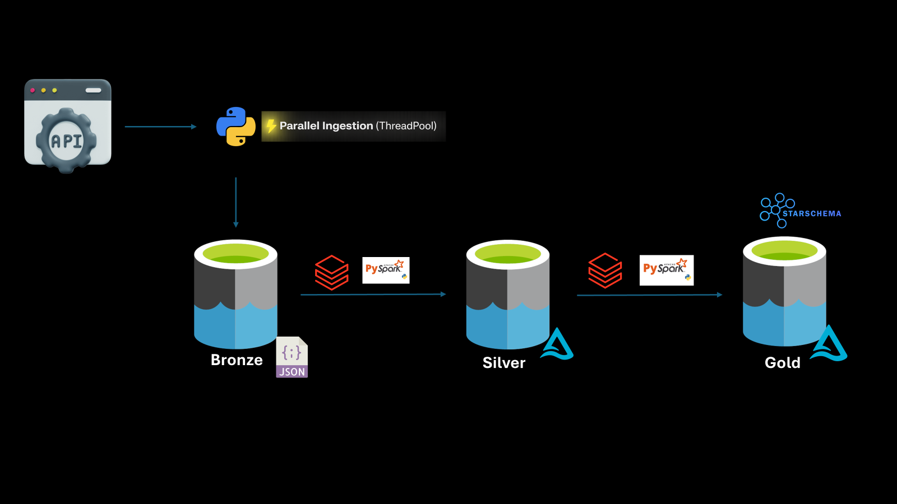

# 🚀 End-to-End Data Engineering Pipeline  - Movie Data
### Azure Data Lake Gen2 | Databricks | Delta Lake | PySpark

---

## 📖 Overview
This project showcases a fully optimized **end-to-end data engineering pipeline** built using modern data engineering practices on Azure.

The pipeline is designed to be **dynamic, scalable, and performance-optimized**, handling data ingestion from APIs to analytics-ready data models using the **Medallion Architecture (Bronze → Silver → Gold)**.

---

## 🏗️ Architecture

---

## ⚙️ Tech Stack

| Category        | Technology |
|----------------|----------|
| Storage        | Azure Data Lake Storage Gen2 |
| Compute        | Databricks |
| Processing     | PySpark |
| File Format    | JSON (Bronze), Delta Lake (Silver & Gold) |
| Ingestion      | REST API + Pagination + ThreadPool |
| Modeling       | Star Schema |
| Optimization   | Partitioning, Z-ORDER, Liquid Clustering |

---

## 🔄 Pipeline Design

### 🥉 Bronze Layer – Raw Ingestion
- API data ingestion with pagination support  
- Parallel processing using Python ThreadPool  
- Stored in JSON format  
- Folder structure:
  /bronze/YYYY/MM/file_<load_date>.json
- Raw data preserved (duplicates allowed)

---

### 🥈 Silver Layer – Data Transformation
- Data cleansing and standardization  
- Null handling and type casting  
- Schema enforcement  
- Stored as Delta tables  
- Partitioned for efficient reads  
- Used `persist()` to optimize transformations

---

### 🥇 Gold Layer – Data Modeling
- Designed using Star Schema:
- Fact Tables  
- Dimension Tables  
- Bridge Tables  

#### Optimizations Applied:
- Partitioning on low-cardinality columns  
- Z-ORDER on high-cardinality columns  
- Liquid Clustering for dimension tables
- partition and file skipping on merge

---

## ⚡ Performance Optimization Techniques

- Incremental data processing using MERGE (UPSERT)  
- Partition pruning for faster reads  
- File skipping using Delta metadata  
- Reduced scan cost during merge operations  
- Optimized joins and transformations  
- Efficient storage layout for analytical queries  

---

## 📊 Key Highlights

- 🚀 End-to-end pipeline (API → Bronze → Silver → Gold)  
- ⚡ High-performance ingestion using ThreadPool  
- 📈 Scalable architecture using Delta Lake  
- 🔄 Incremental processing design  
- 🧠 Smart partitioning and indexing strategies  
- 🏗️ Production-ready architecture  

---

## 📌 Conclusion

This project demonstrates a **dynamic, scalable, and highly optimized data engineering pipeline** built for real-world scenarios, focusing on both performance and maintainability.

